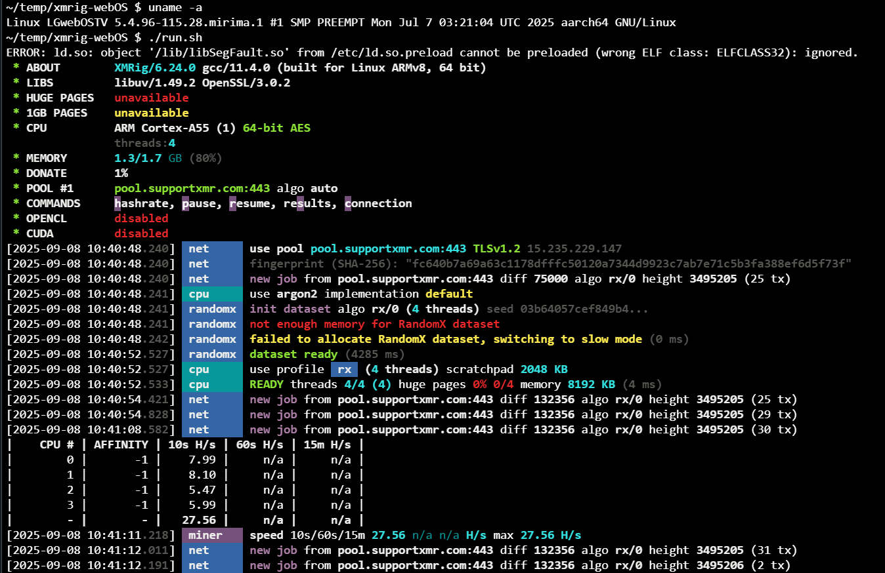

# XMRig for webOS

## Prerequisites
- Developer mode must be enabled
- Terminal access must be available through webOS Dev Manager
- Architecture must be aarch64

## Installation & Execution
1. Clone this repository and place the folder under `~/temp`
2. Run the command: `chmod -R 777 ~/temp/xmrig-webOS`
3. Configure `config.json` using the [wizard](https://xmrig.com/wizard)
4. Execute using `run.sh`

## Additional Information
### Test Environment

This build has been tested on the following environment:

- **Model:** 50QNED80JQA
- **OS:** webOS 22 7.5.5-1901
